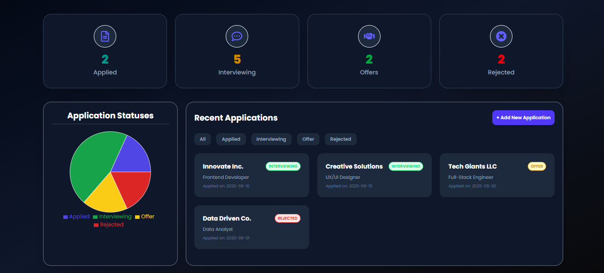
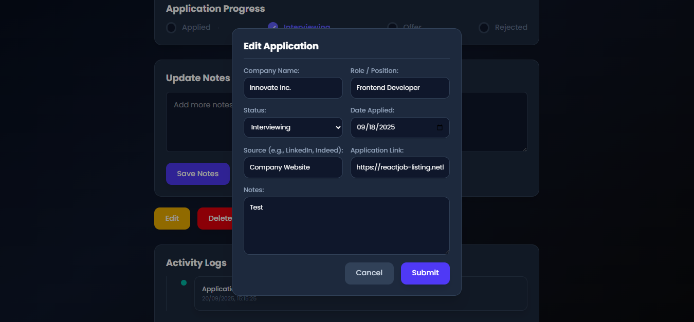

# 🎯 Job Tracker Application

A seamless dark theme and interactive Job Application Tracker built with React,
Tailwind CSS, and JSON Server.\
This app helps you keep track of job applications, monitor their
statuses, and visualize progress with charts.

## 🚀 Features

-   ✍️ Add new applications with role, company, status, link, and
    notes.\
-   📝 Activity Logs --- automatically track changes (e.g., status
    updates, edits).\
-   📊 Statistics Dashboard --- visualize application statuses with
    Recharts (pie charts, etc).\
-   🔍 Search & Filter --- filter by status, company, or role.\
-   🗑️ Edit & Delete applications.\
-   🎨 Responsive UI --- styled with Tailwind CSS.\
-   ⚡ Fast local API powered by JSON Server.

## 🛠️ Tech Stack

-   **Frontend:** React + Tailwind CSS\
-   **State Management:** React Hooks (useState, useEffect, useLoaderData, useSearchParams)\
-   **Charts:** Recharts\
-   **Backend (mock API):** JSON Server

## 📦 Installation & Setup

**Clone this repo**

``` bash
git clone https://github.com/diddy0077/job-app-tracker.git
cd job-app-tracker
```

**Install dependencies**

``` bash
npm install
```

**Start JSON Server (mock backend)**

``` bash
npx json-server --watch db.json --port 5000
```

➡️ Make sure you have a `db.json` file with an `"applications": []`
array.

**Run React app**

``` bash
npm run dev
```

➡️ App will start at <http://localhost:5173> (if using Vite).

## 📊 Example db.json

``` json
{
  "applications": [
    {
      "id": 1,
      "role": "Frontend Developer",
      "company": "Tech Corp",
      "status": "Applied",
      "date": "2025-09-01",
      "source": "LinkedIn",
      "link": "https://example.com/job",
      "notes": "Follow up next week",
      "activityLog": [
        {
          "message": "Application Created",
          "timeStamp": "2025-09-01T10:00:00Z"
        }
      ]
    }
  ]
}
```

## 📸 Screenshots
Dashboard | Single Application Page
:-------------------------:|:-------------------------:
 | 

## 💡 Future Improvements

-   🔐 Add user authentication (login/signup).\
-   🌙 Dark mode toggle.\
-   📧 Email reminders for follow-ups.\
-   🗂️ Export applications as CSV/PDF.

## 👨‍💻 Author

Built with ❤️ by **Daniel Udeh**

-   [Portfolio](https://diddy0077.github.io/daniel-udeh/index.html)\
-   [LinkedIn](https://www.linkedin.com/in/daniel-udeh-a03971350/)\
-   [GitHub](https://github.com/diddy0077/)
